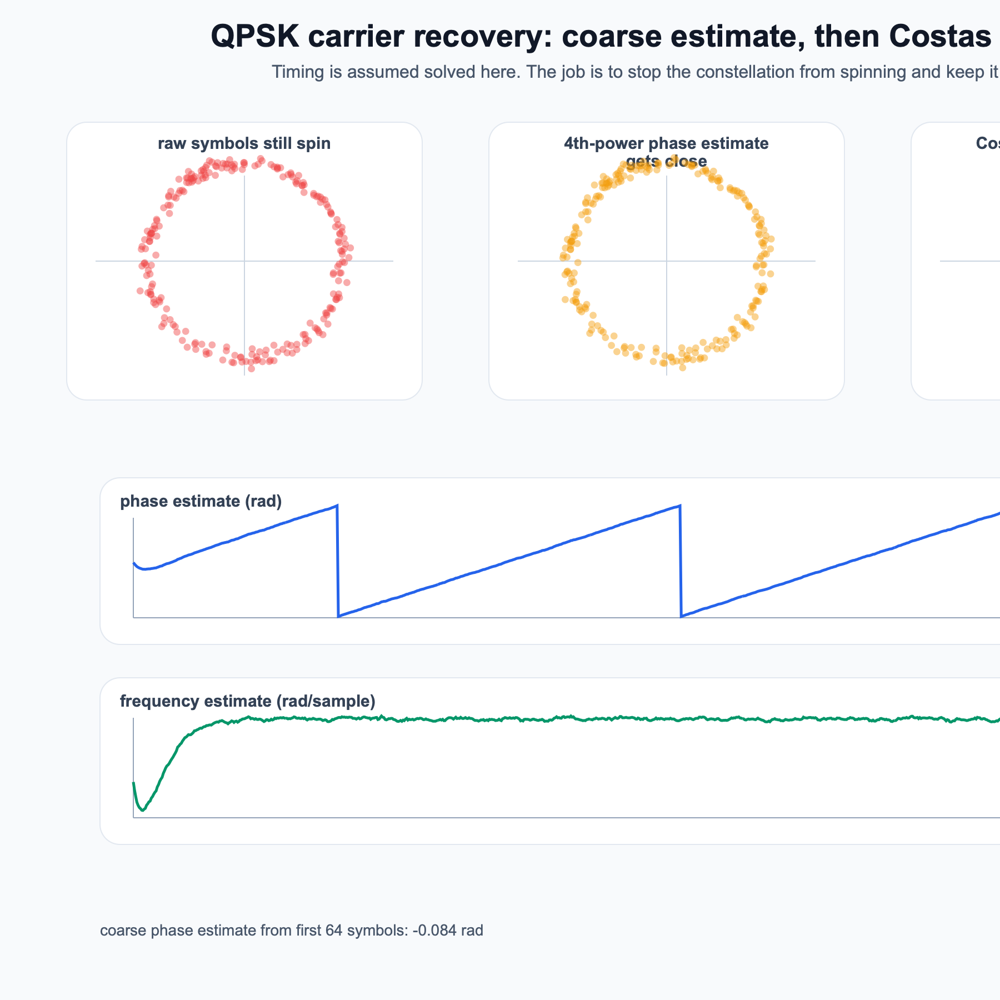
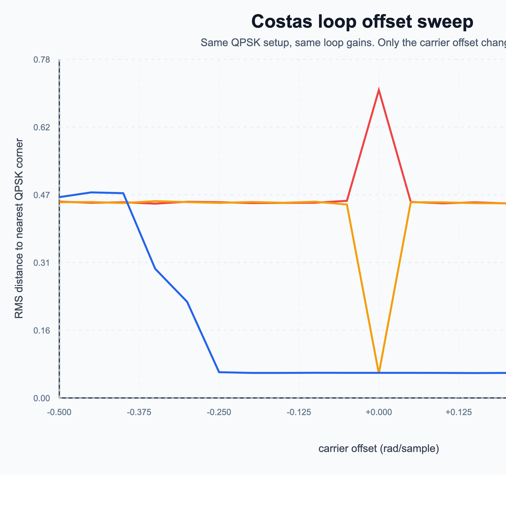
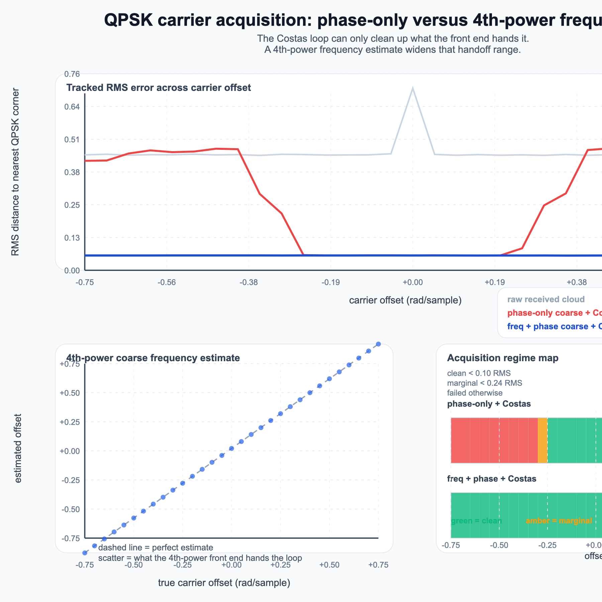
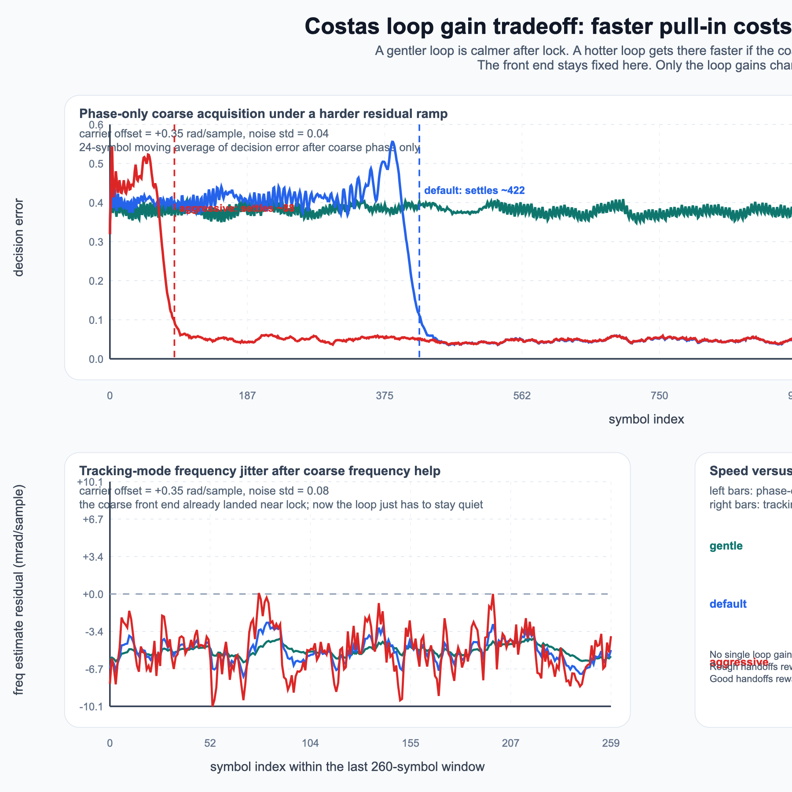
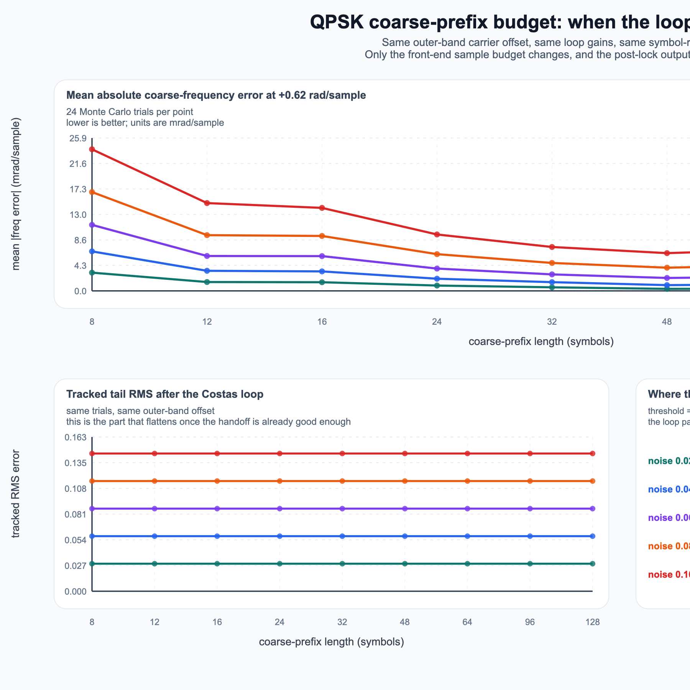
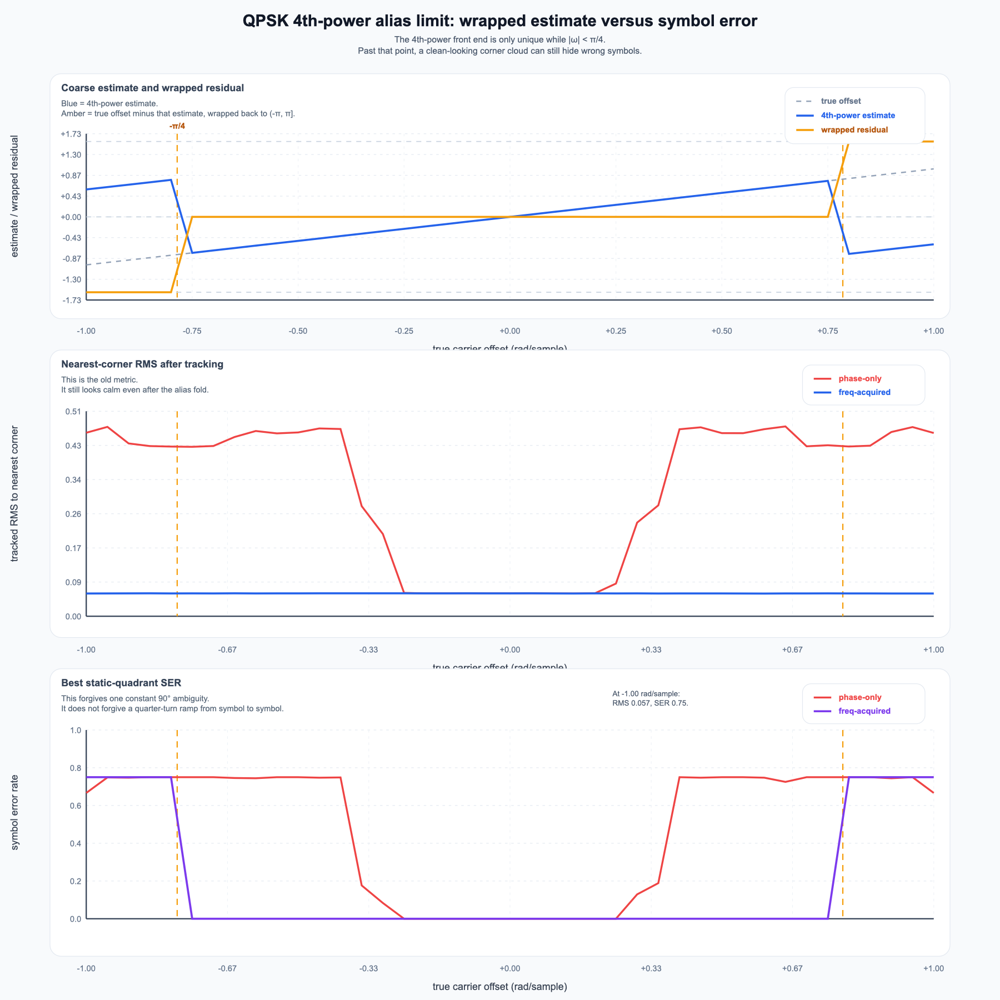

# Costas Loop Lab

A tiny pure-Python lab for one specific receive-side job: stop a QPSK constellation from spinning after timing is already good enough.

This repo is about the handoff between a coarse carrier estimate and fine Costas-loop tracking.
Not a full modem. Not a grab bag of SDR buzzwords. Just the carrier-recovery part, made visible.

## What is here

- deterministic QPSK symbol generator and carrier-offset channel
- coarse 4th-power phase estimate for QPSK, with the expected quadrant ambiguity
- coarse 4th-power frequency estimate so the front end can remove a real carrier ramp before the loop takes over
- Costas-loop tracker with recorded phase and frequency traces
- generated figures for the baseline demo, the original offset sweep, the acquisition-range map that compares phase-only correction against phase-plus-frequency acquisition, a loop-gain tradeoff study that makes pull-in speed fight steady-state calm in one view, a coarse-prefix budget card that shows when front-end sample count still matters and when the loop has already stopped caring, and a new alias-limit map that shows where the 4th-power estimate folds and why a clean-looking constellation can still mean the symbol labels are wrong
- companion notebooks and small tests that check the acquisition chain actually helps and catch the new alias-cliff failure mode

## Gallery

### QPSK carrier-recovery demo



### Carrier-offset sweep



### Acquisition range map



This is the new spine of the repo. It shows the actual handoff: phase-only coarse correction stays clean only near the center, while a 4th-power frequency estimate keeps the Costas loop inside a much wider pull-in window until the `\pi/4` alias limit shows up.

### Loop-gain tradeoff study



This follow-up pass answers a different question: once the front end is fixed, how hard should the loop push? The figure separates two regimes instead of mushing them together: on a rough phase-only handoff, hotter gains pull in faster; once coarse frequency help already landed near lock, gentler gains leave a quieter residual.

### Coarse-prefix budget card



This new sidecar answers a narrower front-end question. More prefix symbols keep making the 4th-power frequency estimate cleaner, but the tracked RMS flattens much sooner once the handoff is already inside the loop's comfort zone. In this model, longer prefixes mostly buy estimator honesty before they buy visible post-lock improvement.

### Alias-limit map



This new sidecar closes a subtler hole in the older figures. Once the true offset crosses `\pi/4`, the 4th-power estimate folds onto the wrong branch. The tracked cloud can still look clean under the old nearest-corner RMS metric, but a best static-quadrant symbol check shows the real failure: the labels are wrong even though the scatter still lands on QPSK corners.

## Why this repo is worth opening

Carrier recovery often gets explained as if one loop does everything.
That is the mushy version.

The useful version is narrower:

- timing recovery tells you when to sample,
- coarse carrier logic gets the constellation into the right neighborhood, even if quadrant labeling is still ambiguous,
- a Costas loop keeps it from drifting away again.

This repo opens with that split made explicit.
It now ships code, figures, notebooks, a range map that shows exactly when the front end has done enough work for the loop to finish the job, a gain-tradeoff pass that shows why tuning still matters after acquisition is already in place, a coarse-prefix budget card that shows when adding more front-end symbols mostly stops changing the loop output, and an alias-limit map that catches one easy-to-miss failure mode: the front end can wrap to the wrong branch and still look visually tidy if you only stare at nearest-corner error.

## Quick start

Generate the gallery and reports:

```bash
python3 scripts/generate_gallery.py
```

Run the tests:

```bash
python3 -m unittest discover -s tests
```

Run one demo and emit a JSON summary:

```bash
python3 -m costaslab.cli demo --freq-offset 0.022 --output assets/qpsk-costas-demo.svg
```

Sweep offsets and render the comparison figure:

```bash
python3 -m costaslab.cli sweep --min-offset -0.5 --max-offset 0.5 --steps 21 --output assets/qpsk-costas-offset-sweep.svg
```

Compare phase-only coarse acquisition against the 4th-power frequency-assisted chain:

```bash
python3 -m costaslab.cli acquisition-sweep --min-offset -0.75 --max-offset 0.75 --steps 31 --output assets/qpsk-acquisition-range-map.svg --png-output assets/qpsk-acquisition-range-map.png
```

Compare gentle, default, and aggressive loop gains under one acquisition stress case and one tracking stress case:

```bash
python3 -m costaslab.cli gain-study --output assets/qpsk-loop-gain-tradeoffs.svg --png-output assets/qpsk-loop-gain-tradeoffs.png
```

Measure how coarse-prefix length changes the 4th-power estimate and the post-loop output:

```bash
python3 -m costaslab.cli prefix-budget-study --output assets/qpsk-coarse-prefix-budget.svg --png-output assets/qpsk-coarse-prefix-budget.png
```

Show where the 4th-power estimate aliases and where the clean-looking output becomes falsely reassuring:

```bash
python3 -m costaslab.cli alias-limit-study --output assets/qpsk-alias-limit-map.svg --png-output assets/qpsk-alias-limit-map.png
```

## Repo layout

- `costaslab/signal.py`: QPSK source and channel rotation
- `costaslab/loop.py`: coarse phase and coarse frequency estimates plus the Costas tracking loop
- `costaslab/analysis.py`: RMS decision-error metrics, symbol-agreement checks, offset sweeps, acquisition-mode comparisons, loop-gain studies, the coarse-prefix budget sweep, and the alias-limit study
- `costaslab/render.py`: SVG figure generation plus PNG export helper for GitHub previews
- `costaslab/cli.py`: demo, sweep, acquisition-sweep, gain-study, prefix-budget-study, and alias-limit-study commands
- `scripts/generate_gallery.py`: reproducible asset build
- `reports/qpsk-carrier-recovery.md`: generated baseline summary for the original figures
- `reports/qpsk-frequency-acquisition.md`: generated summary for the new acquisition-range pass
- `reports/qpsk-loop-gain-tradeoffs.md`: generated summary for the speed-versus-jitter pass
- `reports/qpsk-coarse-prefix-budget.md`: generated summary for the new front-end budget pass
- `reports/qpsk-alias-limit.md`: generated summary for the alias-cliff and false-clean sidecar
- `notebooks/frequency_acquisition_and_pull_in.ipynb`: slower technical walkthrough with equations, caveats, and problems
- `notebooks/coarse_prefix_budget.ipynb`: notebook companion for the new front-end budget card
- `notebooks/alias_limit_and_false_clean_metric.ipynb`: notebook companion for the alias-limit and false-clean failure mode
- `tests/test_costas.py`: verification layer for phase estimation, frequency estimation, pull-in improvements, loop-gain tradeoffs, the coarse-prefix study, and the new alias-limit checks

## Scope boundary

This stays in the receive-study lane.
No live-emission procedures, no hardware control, no giant SDR framework.

## Next good moves

- add one sidecar note on why decision-directed tracking alone is fragile when the slicer is still wrong
- compare coarse-prefix budget against loop-gain tuning in one shared card so the repo can show exactly when front-end quality matters more than gain polish
- compare this symbol-rate alias card against one oversampled front end so the repo can say when the `\pi/4` cliff is a real system limit and when it is only a symbol-rate modeling limit

That is enough for this repo to open as a real lab instead of a single neat picture.

— Jarbas
