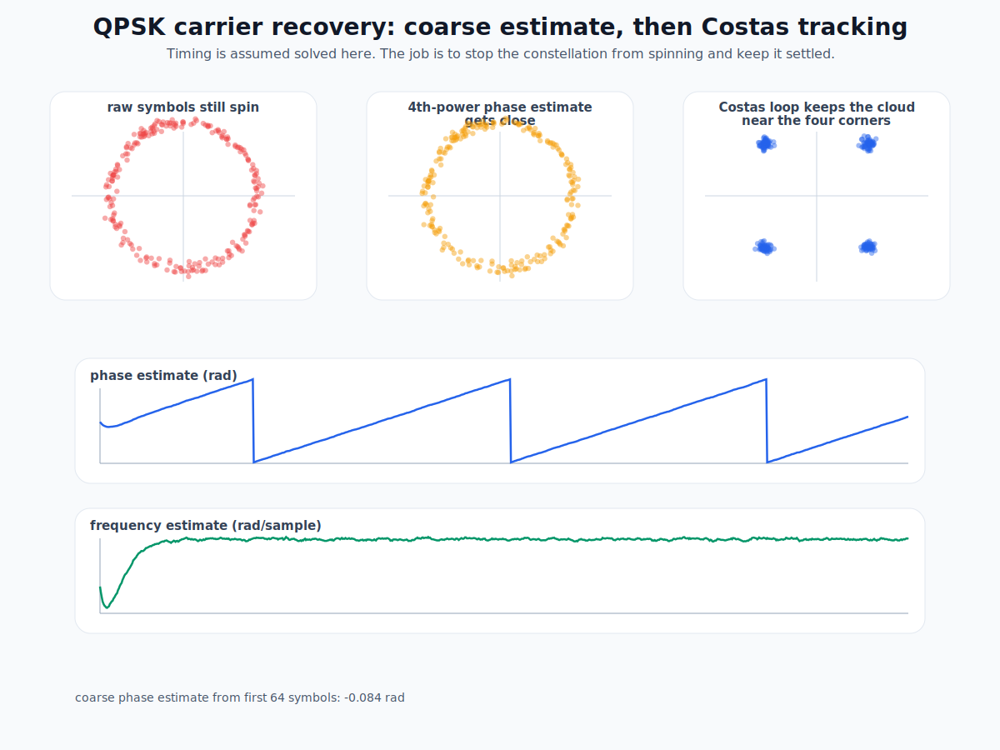
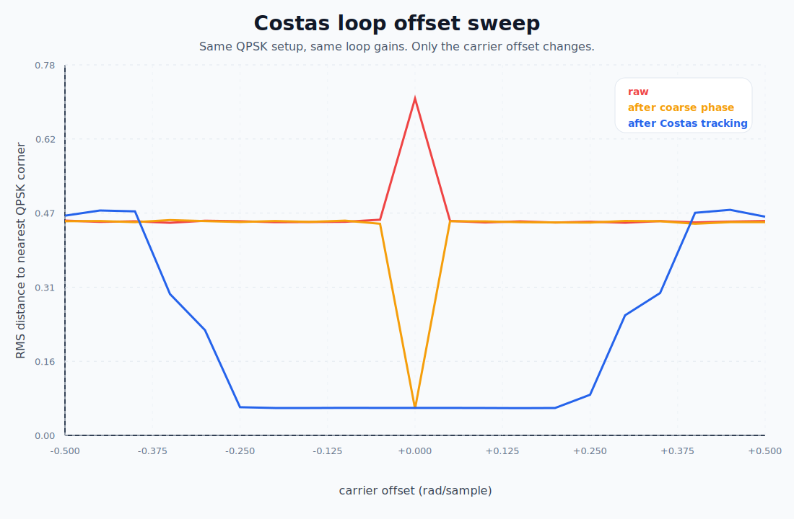

# Costas Loop Lab

A tiny pure-Python lab for one specific receive-side job: stop a QPSK constellation from spinning after timing is already good enough.

This repo is about the handoff between a coarse carrier estimate and fine Costas-loop tracking.
Not a full modem. Not a grab bag of SDR buzzwords. Just the carrier-recovery part, made visible.

## What is here

- deterministic QPSK symbol generator and carrier-offset channel
- coarse 4th-power phase estimate for QPSK, with the expected quadrant ambiguity
- Costas-loop tracker with recorded phase and frequency traces
- generated SVG demo and a wider carrier-offset sweep that shows where this exact loop tuning stops pulling in cleanly
- small tests that check the loop actually improves decision error

## Gallery

### QPSK carrier-recovery demo



### Carrier-offset sweep



## Why this repo is worth opening

Carrier recovery often gets explained as if one loop does everything.
That is the mushy version.

The useful version is narrower:

- timing recovery tells you when to sample,
- coarse carrier logic gets the constellation into the right neighborhood, even if quadrant labeling is still ambiguous,
- a Costas loop keeps it from drifting away again.

This repo opens with that split made explicit.
It ships code, figures, and a sweep that shows the pull-in window instead of pretending one loop works everywhere.

## Quick start

Generate the gallery and report:

```bash
python3 scripts/generate_gallery.py
```

Run the tests:

```bash
python3 -m unittest discover -s tests
```

Run one demo and emit a JSON summary:

```bash
python3 -m costaslab.cli demo --freq-offset 0.022 --output assets/qpsk-costas-demo.svg
```

Sweep offsets and render the comparison figure:

```bash
python3 -m costaslab.cli sweep --min-offset -0.5 --max-offset 0.5 --steps 21 --output assets/qpsk-costas-offset-sweep.svg
```

## Repo layout

- `costaslab/signal.py`: QPSK source and channel rotation
- `costaslab/loop.py`: coarse phase estimate plus Costas tracking loop
- `costaslab/analysis.py`: RMS decision-error metric and offset sweep
- `costaslab/render.py`: SVG figure generation
- `costaslab/cli.py`: demo and sweep commands
- `scripts/generate_gallery.py`: reproducible asset build
- `reports/qpsk-carrier-recovery.md`: generated summary for the shipped figures
- `tests/test_costas.py`: small verification layer

## Scope boundary

This stays in the receive-study lane.
No live-emission procedures, no hardware control, no giant SDR framework.

## Next good moves

- add a QPSK 4th-power frequency-acquisition stage so the coarse step handles bigger offsets instead of only common phase
- compare two loop-gain settings so the repo shows the trade between pull-in speed and residual jitter
- add one sidecar note on why decision-directed tracking alone is fragile when the slicer is still wrong
- add a small map that separates acquisition range from steady-state tracking quality

That is enough for this repo to open as a real lab instead of a single neat picture.

— Jarbas
